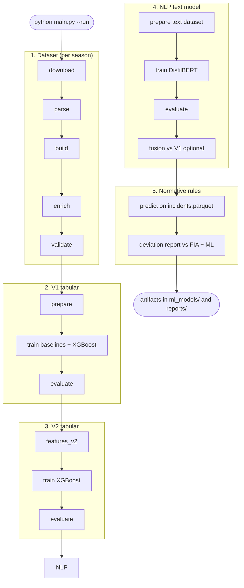

# f1_penalty_predictor

Research pipeline for analyzing Formula 1 stewarding decisions from two complementary angles:

1. **FIA behavior model** — supervised ML that learns how stewards actually decide penalties
2. **Normative rules engine** — deterministic rule set encoding one documented interpretation of racing regulations

Comparing the two surfaces where real decisions diverge from a consistent rule-based baseline.

```
FIA PDFs  →  dataset pipeline  →  incidents.parquet
                                        │
                    ┌───────────────────┼───────────────────┐
                    ▼                   ▼                   ▼
              XGBoost V1/V2      normative rules      deviation report
           (learns FIA labels)   (no ML training)    (FIA vs normative)
```

---

## Current status

| Area | Status | Notes |
|------|--------|-------|
| Dataset generation | **Operational** | 2019 + 2025 seasons (546 raw incidents → 234 driver-rows for ML) |
| Data enrichment | **Implemented** (partial fill) | Full pipeline wired (`configs/enrichment.yaml`); lap/flag/positions blocked by PDF timestamps — see [`current_gaps.md`](current_gaps.md) |
| Model training (V1) | **Complete** | Validation macro-F1 **0.402** (train 2019 / val 2025) |
| Feature engineering (V2) | **Complete** | Validation macro-F1 **0.381** — did not beat V1 on this corpus |
| NLP text model (spec V2) | **Complete** | DistilBERT on Fact+Offence; val macro-F1 **0.642** (train 2019 / val 2025, 154 rows) — beats V1 tabular (0.402) |
| Normative rule engine | **Operational** | 17 rules; deviation report generated |
| Normative rule coverage | **Incomplete** | 59.8% of rows routed to `manual_review` (target ≤20%) |
| Seasons 2020–2024 | **Missing** | FIA download blocked; manual PDF backfill possible |
| Held-out test season | **Not set** | Only train/validation split exists today |

For the full gap registry (missing columns, blockers, success criteria): [`current_gaps.md`](current_gaps.md).

### Data corpus limitation (2019 + 2025 only)

**All current artifacts reflect a two-season corpus.** Dataset generation, enrichment, flatten/`prepare`, V1/V2 training, normative evaluation, NLP dataset joins, and reports were designed for **2019 and 2025 only**. Seasons **2020–2024** are listed in [`configs/data.yaml`](configs/data.yaml) but have no `processed_{season}.csv` — FIA download is blocked (403/WAF) unless PDFs are added manually.

When 2020–2024 become available, **downstream work must be re-run** on the expanded corpus (not a one-click refresh today):

| Step | What to re-run |
|------|----------------|
| Dataset | [`dataset/scripts/run_pipeline.py`](dataset/scripts/run_pipeline.py) per new season (`--stage all`, or `parse` → `build` → `enrich` → `validate` if PDFs are already on disk) |
| ML features | `python -m fia_ml.training.run_training --stage prepare` (and `features_v2` for V2) — update `inputs.seasons` / splits in [`configs/xgboost.yaml`](configs/xgboost.yaml) / [`configs/xgboost_v2.yaml`](configs/xgboost_v2.yaml) |
| Models | `--stage train` / `evaluate` (and ablation for V2) |
| NLP text model | `python -m fia_ml.training.run_nlp_training --config configs/bert.yaml --stage all` (optional `--fusion`) |
| Normative | `python -m fia_ml.normative.run_normative` on refreshed `incidents.parquet` |

Step-by-step backfill commands, manual PDF layout, and WAF troubleshooting: [`dataset/scripts/README.md`](dataset/scripts/README.md) (sections **Current dataset coverage** and **Missing seasons — how to backfill later**). The pipeline is **season-agnostic** — no code changes are required for new years once PDFs exist; configs and training splits need updating.

---

## Quick start

```powershell
# From project root
pip install -r requirements.txt

# End-to-end orchestrator (main.py) — bare `python main.py` does nothing; pass --run to execute
python main.py --dry-run
python main.py --run --skip-download
python main.py --run --from v1
python main.py --run --skip-v2 --skip-nlp

# Run tests
python -m pytest

# Dataset pipeline (season with PDFs or working FIA access)
python dataset/scripts/run_pipeline.py --stage all --season 2019

# V1 model training (prepare → train → evaluate)
python -m fia_ml.training.run_training --config configs/xgboost.yaml

# V2 features + training + ablation
python -m fia_ml.training.run_training --config configs/xgboost_v2.yaml --stage all

# NLP text model (prepare → train → evaluate; optional late fusion vs V1)
python -m fia_ml.training.run_nlp_training --config configs/bert.yaml --stage all
python -m fia_ml.training.run_nlp_training --config configs/bert.yaml --stage evaluate --fusion

# Normative rules — apply rules to incidents
python -m fia_ml.normative.run_normative --input data/processed/incidents.parquet

# Normative — deviation report vs FIA labels
python -m fia_ml.normative.run_normative `
  --input data/processed/incidents_with_normative.parquet `
  --compare `
  --ml-predictions ml_models/xgboost_v2/predictions_val.json `
  --report-dir reports/normative/
```

Set `PYTHONPATH=src` if imports fail outside a virtualenv, or run modules as shown above from the project root.

### End-to-end orchestrator (`main.py`)

`main.py` chains all pipelines in order. **Security default:** bare `python main.py` prints help and exits; you must pass `--run` to execute (or `--dry-run` to preview).



| Command | Effect |
|---------|--------|
| `python main.py` | Help only; no execution |
| `python main.py --dry-run` | Print phase plan and prerequisite checks |
| `python main.py --run` | Full run including FIA PDF download |
| `python main.py --run --skip-download` | Dataset parse onward (PDFs on disk) |
| `python main.py --run --only v1` | **Single phase** — V1 tabular only |
| `python main.py --run --only v2` | **Single phase** — V2 tabular only |
| `python main.py --run --only nlp` | **Single phase** — NLP only |
| `python main.py --run --only normative` | **Single phase** — normative only |
| `python main.py --run --from v1` | V1 through normative (not dataset alone) |
| `python main.py --run --dataset-only` | Dataset phase only |
| `python main.py --run --no-fusion` | Skip NLP late-fusion step |

**Prerequisites** (checked before each phase runs; missing files block with an error):

| Phase | Requires |
|-------|----------|
| `dataset` | Nothing (download needs FIA access) |
| `v1` | `dataset/csv/processed_{season}.csv` |
| `v2` | `data/processed/incidents.parquet` (from V1 prepare) |
| `nlp` | Processed CSVs + `data/interim/extracted_documents/{season}/` |
| `nlp` + fusion | Above + `ml_models/xgboost/predictions_val.json` |
| `normative` | `data/processed/incidents.parquet` only — **NLP is not required** |

Use `--dry-run` to see which prerequisites are missing before a long run.

**Re-running phases:** If outputs for a phase already exist, you are prompted `Run it again? [Y/N]` before it executes (default **N**). Use `--force` to skip prompts when retraining after backfilling new seasons (e.g. 2020–2024).

---

## Documentation

### Concept & specification

| Document | Description |
|----------|-------------|
| [`documentation/f1_project.md`](documentation/f1_project.md) | Core research idea — dual-lens FIA behavior vs normative rules |
| [`documentation/project_spec.md`](documentation/project_spec.md) | Full project specification, roadmap, and intended directory layout |
| [`documentation/FIA_stewarding_dataset_feature_specification.md`](documentation/FIA_stewarding_dataset_feature_specification.md) | Authoritative feature definitions, leakage rules, and engineering guidance |
| [`documentation/f1_dataset_example.csv`](documentation/f1_dataset_example.csv) | Canonical dataset schema (column reference) |
| [`documentation/dataset_generation_runbook.md`](documentation/dataset_generation_runbook.md) | Operational runbook for dataset generation |

### Module & pipeline docs

| Document | Description |
|----------|-------------|
| [`dataset/scripts/README.md`](dataset/scripts/README.md) | Dataset CLI, season coverage, WAF/backfill notes |
| [`src/fia_ml/data/README.md`](src/fia_ml/data/README.md) | Dataset generation library (`download`, `parsing`, `enrichment`, `validation`) |
| [`src/fia_ml/data/enrichment/README.md`](src/fia_ml/data/enrichment/README.md) | Enrichment cascade (reference → Ergast → timestamp → OpenF1 → FastF1 → SL → text) |
| [`data/reference/README.md`](data/reference/README.md) | Static reference data (circuits, mappings) |
| [`dataset/README.md`](dataset/README.md) | Generated CSV layout |

### Results, gaps & roadmap

| Document | Description |
|----------|-------------|
| [`current_gaps.md`](current_gaps.md) | Open gaps on **existing** pipelines (data quality, normative coverage, model limitations) |
| [`documentation/FUTURE_FEATURES.md`](documentation/FUTURE_FEATURES.md) | **Not built yet** — CNN, telemetry, embeddings, full multimodal |
| [`reports/model_reports/v1_training_report_2026-08-24.md`](reports/model_reports/v1_training_report_2026-08-24.md) | V1 training write-up |
| [`reports/model_reports/v2_feature_engineering_report_2026-08-25.md`](reports/model_reports/v2_feature_engineering_report_2026-08-25.md) | V2 ablation + selection write-up |
| [`reports/normative/deviation_summary_2026-08-25.md`](reports/normative/deviation_summary_2026-08-25.md) | FIA vs normative deviation analysis |
| [`reports/model_reports/enrichment_improvement_2026-09-09.md`](reports/model_reports/enrichment_improvement_2026-09-09.md) | Post-enrichment quality gates (2019 + 2025) |
| [`reports/model_reports/nlp_training_report_2026-09-09.md`](reports/model_reports/nlp_training_report_2026-09-09.md) | NLP DistilBERT training write-up |
| [`reports/model_reports/nlp_comparison_2026-09-09.md`](reports/model_reports/nlp_comparison_2026-09-09.md) | NLP vs V1 tabular fusion comparison |

---

## Key results (validation season 2025)

| Model / system | Metric | Value |
|----------------|--------|-------|
| Majority baseline | macro-F1 | 0.267 |
| Session-stratified baseline | macro-F1 | 0.359 |
| **XGBoost V1** | macro-F1 | **0.402** |
| **NLP DistilBERT** (Fact+Offence) | macro-F1 | **0.642** |
| XGBoost V2 (history + selection) | macro-F1 | 0.381 |
| NLP + V1 fusion (`concat_logits`, 144 merged rows) | macro-F1 | 0.632 |
| Normative vs FIA (all 234 rows) | agreement | 52.6% |
| Normative vs FIA (excl. `manual_review`) | agreement | 79.8% |
| Normative vs ML (144-row val overlap) | agreement | 60.4% |

V2 ablation takeaway: **history features** helped (+0.035 macro-F1); **precedent features** hurt on this two-season corpus. See [`reports/ablation_results.json`](reports/ablation_results.json).

---

## Models & artifacts (`ml_models/`)

### V1 XGBoost — FIA behavior model

Trained on 2019, validated on 2025.

| Artifact | Path |
|----------|------|
| Model weights | `ml_models/xgboost/model.json` |
| Preprocessor | `ml_models/preprocessor.joblib` |
| Validation metrics | `ml_models/xgboost/metrics.json` |
| Validation predictions | `ml_models/xgboost/predictions_val.json` |

Config: [`configs/xgboost.yaml`](configs/xgboost.yaml)

### V2 XGBoost — feature-engineering model

| Artifact | Path |
|----------|------|
| Model weights | `ml_models/xgboost_v2/model.json` |
| Preprocessor | `ml_models/preprocessor_xgboost_v2.joblib` |
| Validation metrics | `ml_models/xgboost_v2/metrics.json` |
| Validation predictions | `ml_models/xgboost_v2/predictions_val.json` |

Config: [`configs/xgboost_v2.yaml`](configs/xgboost_v2.yaml) · Features: [`configs/features.yaml`](configs/features.yaml)

### NLP text model (spec V2 — DistilBERT)

Leakage-safe default: **Fact + Offence** text only (Decision/Reason excluded). Same train 2019 / val 2025 split as V1.

| Artifact | Path |
|----------|------|
| Model + tokenizer | `ml_models/nlp/model/`, `ml_models/nlp/tokenizer/` |
| Validation metrics | `ml_models/nlp/metrics.json` |
| Validation predictions | `ml_models/nlp/predictions_val.json` |
| Dataset audit (join coverage) | `ml_models/nlp/nlp_dataset_audit.json` |
| Fusion comparison (optional) | `ml_models/nlp/fusion_metrics.json`, `reports/model_reports/nlp_comparison_{date}.md` |
| Cached text splits | `data/processed/nlp_train.jsonl`, `nlp_validation.jsonl` |

Config: [`configs/bert.yaml`](configs/bert.yaml) · Code: `src/fia_ml/nlp/`, `src/fia_ml/training/train_nlp.py`, `evaluate_nlp.py`, `fusion_nlp.py`

Training report: [`reports/model_reports/nlp_training_report_2026-09-09.md`](reports/model_reports/nlp_training_report_2026-09-09.md) · Fusion comparison: [`reports/model_reports/nlp_comparison_2026-09-09.md`](reports/model_reports/nlp_comparison_2026-09-09.md)

### Baselines

| Artifact | Path |
|----------|------|
| Fitted models | `ml_models/baseline/model.pkl` |
| Metrics | `ml_models/baseline/metrics.json` |

### Normative rule engine (not trained)

| Artifact | Path |
|----------|------|
| Rule definitions | `configs/normative_rules.yaml` |
| Runtime config | `configs/normative.yaml` |
| Rules version + hash | `ml_models/normative/rules_version.json` |
| Per-incident predictions | `ml_models/normative/predictions.json` |
| Evaluation metrics | `ml_models/normative/evaluation_metrics.json` |

---

## Reports & figures (`reports/`)

| Output | Path |
|--------|------|
| V1 / V2 / NLP training reports | `reports/model_reports/` |
| Confusion matrices, feature importance, V1 vs V2 chart | `reports/figures/` |
| Ablation + feature selection | `reports/ablation_results.json`, `reports/selection_report_v2.json` |
| Normative deviation CSVs + figures | `reports/normative/` |
| Per-season data quality | `reports/tables/data_quality_{season}.json` |
| Enrichment quality gates | `reports/tables/enrichment_report_{season}.json` |
| Enrichment provenance | `data/interim/enrichment_meta/{season}.json` |

---

## Processed data (`data/processed/`)

| Dataset | Path |
|---------|------|
| Flattened incidents (labels) | `data/processed/incidents.parquet` |
| Incidents + normative outcomes | `data/processed/incidents_with_normative.parquet` |
| V1 / V2 encoded features | `data/processed/features.parquet`, `features_v2.parquet` |
| Train / validation splits | `train.parquet`, `validation.parquet`, `train_v2.parquet`, `validation_v2.parquet` |
| NLP text splits (JSONL) | `nlp_train.jsonl`, `nlp_validation.jsonl` |

Source CSVs: `dataset/csv/processed_{season}.csv`

---

## Project structure

```text
f1_penalty_predictor/
├── configs/                  # YAML configs (data, training, features, normative rules)
├── data/
│   ├── raw/fia/              # Downloaded FIA PDFs
│   ├── interim/              # Parsed docs, enrichment_meta sidecars
│   ├── processed/            # Parquet for ML and normative engine
│   └── reference/            # Circuits, static lookups
├── dataset/
│   ├── csv/                  # processed_{season}.csv outputs
│   └── scripts/              # run_pipeline.py CLI
├── documentation/            # Specs and research docs
├── ml_models/                # Trained models and normative outputs
├── reports/                  # Training reports, figures, deviation analysis
├── src/fia_ml/
│   ├── data/                 # Dataset generation pipeline
│   ├── preprocessing/        # Flatten, encode, leakage filter
│   ├── nlp/                  # Text dataset join, leakage-safe templates, labels
│   ├── features/             # V2 feature groups (history, precedent, race, …)
│   ├── training/             # Baselines, XGBoost, NLP, ablation, evaluation
│   └── normative/            # Rule engine, compare, report
├── tests/                    # Unit and integration tests
└── current_gaps.md           # Gap registry
```

---

## Configuration

| File | Purpose |
|------|---------|
| [`configs/data.yaml`](configs/data.yaml) | Dataset pipeline (seasons, paths, API cache dirs) |
| [`configs/enrichment.yaml`](configs/enrichment.yaml) | Enrichment sources, confidence thresholds, quality-gate targets |
| [`configs/target_mapping.yaml`](configs/target_mapping.yaml) | Raw `penalty` string → 3-class `penalty_severity` |
| [`configs/xgboost.yaml`](configs/xgboost.yaml) | V1 training splits and hyperparameters |
| [`configs/xgboost_v2.yaml`](configs/xgboost_v2.yaml) | V2 training (feature version, ablation hooks) |
| [`configs/bert.yaml`](configs/bert.yaml) | NLP text model (text profile, DistilBERT, fusion) |
| [`configs/features.yaml`](configs/features.yaml) | V2 feature group toggles |
| [`configs/normative.yaml`](configs/normative.yaml) | Normative engine runtime settings |
| [`configs/normative_rules.yaml`](configs/normative_rules.yaml) | Human-authored stewarding rules |

**Target classes:** `0` = no penalty · `1` = minor · `2` = major (see [`configs/target_mapping.yaml`](configs/target_mapping.yaml)).

---

## What's next

**Gaps (existing systems):** [`current_gaps.md`](current_gaps.md) — seasons 2020–2024, PDF session timestamps (lap/flag), normative `manual_review` rate, V2 vs V1 limitations, NLP corpus/join coverage.

**Future capabilities:** [`documentation/FUTURE_FEATURES.md`](documentation/FUTURE_FEATURES.md) — **CNN** on incident video, telemetry, embedding-based precedent (V3), full multimodal fusion (V5).

---

## License

See [`LICENSE`](LICENSE).
