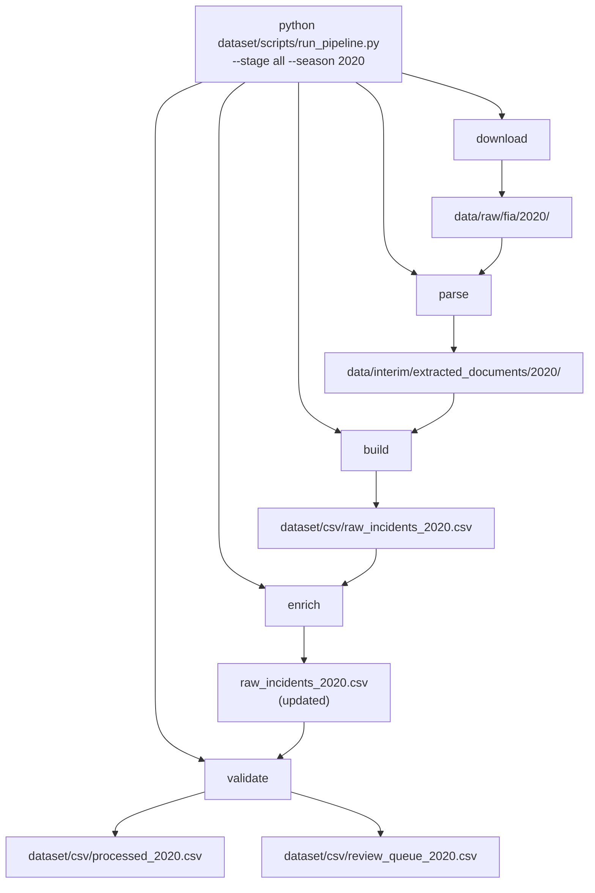

# Dataset outputs and CLI

This folder holds **generated CSV datasets** and the **pipeline CLI script**.

| Path | Purpose |
|------|---------|
| `csv/` | `raw_incidents_{season}.csv`, `processed_{season}.csv`, review queues |
| `scripts/run_pipeline.py` | Command-line entry point for the full pipeline |

Pipeline **library code** lives in [`src/fia_ml/data/`](../src/fia_ml/data/README.md).

---

## End-to-end flow



---

## Quick commands

Run from the **project root**:

```bash
# Full pipeline for one season
python dataset/scripts/run_pipeline.py --stage all --season 2020

# Raw CSV only (stages 1–3)
python dataset/scripts/run_pipeline.py --stage download --season 2020
python dataset/scripts/run_pipeline.py --stage parse   --season 2020
python dataset/scripts/run_pipeline.py --stage build   --season 2020

# Processed CSV only (stages 4–5, needs raw first)
python dataset/scripts/run_pipeline.py --stage enrich    --season 2020
python dataset/scripts/run_pipeline.py --stage validate  --season 2020
```

---

## Further reading

- [`src/fia_ml/data/README.md`](../src/fia_ml/data/README.md) — full pipeline docs, stage diagrams, module reference
- [`src/fia_ml/data/enrichment/README.md`](../src/fia_ml/data/enrichment/README.md) — enrichment cascade and column sources
