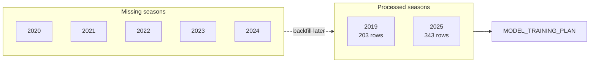
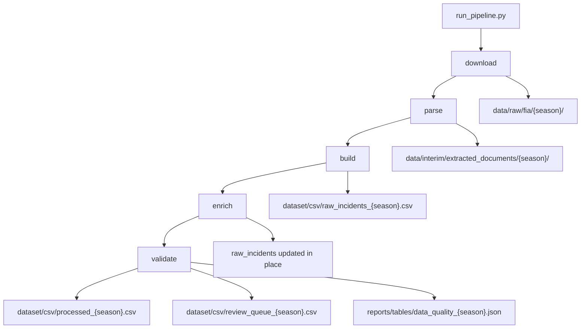

# Pipeline CLI (`dataset/scripts`)

Command-line entry point for the FIA dataset generation pipeline.

| Script | Purpose |
|--------|---------|
| [`run_pipeline.py`](run_pipeline.py) | Run download → parse → build → enrich → validate |

Library code lives in [`src/fia_ml/data/`](../../src/fia_ml/data/README.md). Run all commands from the **project root**.

---

## Quick start

```powershell
pip install -r requirements.txt

# Full pipeline for seasons that already have PDFs or when FIA access works
python dataset/scripts/run_pipeline.py --stage all --season 2019

# Re-enrich + validate existing raw CSVs (no download needed)
python dataset/scripts/run_pipeline.py --stage enrich --season 2019 --season 2025
python dataset/scripts/run_pipeline.py --stage validate --season 2019 --season 2025
```

### CLI flags

| Flag | Description |
|------|-------------|
| `--stage` | `all`, `download`, `parse`, `build`, `enrich`, `validate` (default: `all`) |
| `--season` | Year to process (repeatable). Default: all seasons in `configs/data.yaml` |
| `--config` | Path to config (default: `configs/data.yaml`) |

---

## Current dataset coverage

Status as of the last successful pipeline runs. See [`src/fia_ml/data/README.md`](../../src/fia_ml/data/README.md) for full pipeline docs.

| Season | `processed_{season}.csv` | Rows | Notes |
|--------|------------------------|------|-------|
| **2019** | Yes | 203 | Complete — ready for model training |
| 2020 | No | — | **Missing** — FIA download blocked (403/WAF) |
| 2021 | No | — | **Missing** — FIA download blocked |
| 2022 | No | — | **Missing** — FIA download blocked |
| 2023 | No | — | **Missing** — FIA download blocked |
| 2024 | No | — | **Missing** — FIA download blocked |
| **2025** | Yes | 343 | Complete — ready for model training |

**Available now:** 546 incident rows across 2019 + 2025 — enough to proceed to [`MODEL_TRAINING_PLAN.md`](../../MODEL_TRAINING_PLAN.md).



---

## Missing seasons — how to backfill later

When FIA access works again (or PDFs are obtained manually):

```powershell
# One season at a time — avoid bulk runs that trigger FIA blocks
python dataset/scripts/run_pipeline.py --stage all --season 2020
```

If download still fails but you have PDFs on disk, place them under `data/raw/fia/{season}/{event_slug}/` and skip download:

```powershell
python dataset/scripts/run_pipeline.py --stage parse --season 2020
python dataset/scripts/run_pipeline.py --stage build --season 2020
python dataset/scripts/run_pipeline.py --stage enrich --season 2020
python dataset/scripts/run_pipeline.py --stage validate --season 2020
```

FIA blocking troubleshooting:

- Set `scraper.fetch_backend: playwright` in `configs/data.yaml`
- Install: `pip install playwright` then `playwright install chromium`
- Try `playwright_headless: false` if headless mode is blocked
- Probe access: `python scripts/probe_fia.py`

---

## Enrichment

Full hybrid stack is wired (`configs/enrichment.yaml`). Re-enrich without re-downloading:

```bash
python dataset/scripts/run_pipeline.py --stage enrich --season 2019 --season 2025
python dataset/scripts/run_pipeline.py --stage validate --season 2019 --season 2025
```

Open gaps (lap/flag/positions, multi-driver rows, 2020–2024 seasons): [`current_gaps.md`](../../current_gaps.md) · module detail: [`src/fia_ml/data/enrichment/README.md`](../../src/fia_ml/data/enrichment/README.md).

Observed fill rates (`reports/tables/data_quality_{season}.json`, post-enrichment 2026-09-09):

| Column | 2019 | 2025 |
|--------|------|------|
| `driver_standings` (round N−1) | 96% | 78% |
| `superlicense_points_before_incident` | 99% | 81% |
| `full_laps` / weather / `safety_car` | 90% | 89% |
| `lap` | 1.5% | 0.3% |
| `flag` / `positions_of_involved parties` | 0% | 0% |
| `severity` | 0% | 0% |
| `driver_at_fault` (rule assist) | 25% | 25% |

---

## Stage reference



| Stage | When to use without download |
|-------|------------------------------|
| `enrich` | `raw_incidents_{season}.csv` exists |
| `validate` | After enrich (or to refresh review queue) |
| `parse` + `build` | PDFs already in `data/raw/fia/{season}/` |

---

## Outputs per season

```text
dataset/csv/raw_incidents_{season}.csv
dataset/csv/raw_incidents_{season}.meta.json
dataset/csv/processed_{season}.csv          # primary training input
dataset/csv/review_queue_{season}.csv       # regenerated on validate
reports/tables/data_quality_{season}.json   # column fill rates + enrichment gates
reports/tables/enrichment_report_{season}.json
data/interim/enrichment_meta/{season}.json
```

---

## Related docs

- [`../README.md`](../README.md) — dataset folder overview
- [`../../src/fia_ml/data/README.md`](../../src/fia_ml/data/README.md) — pipeline modules and architecture
- [`../../src/fia_ml/data/enrichment/README.md`](../../src/fia_ml/data/enrichment/README.md) — enrichment modules and gaps
- [`../../DATASET_GENERATION_PLAN.md`](../../DATASET_GENERATION_PLAN.md) — full implementation plan
- [`../../MODEL_TRAINING_PLAN.md`](../../MODEL_TRAINING_PLAN.md) — next step with 2019 + 2025 data
