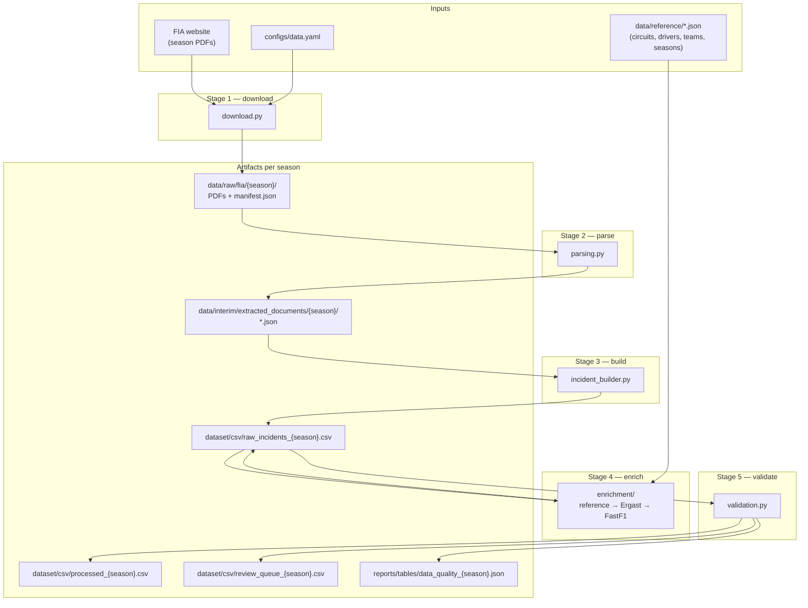
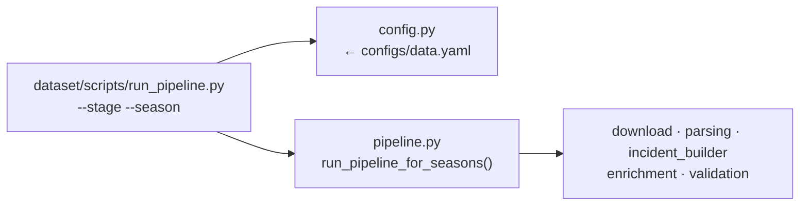
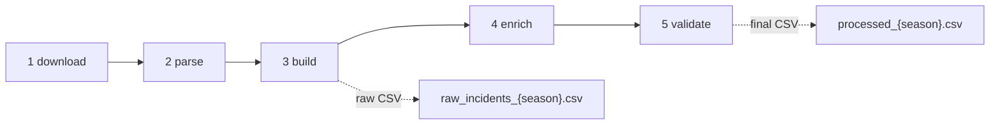
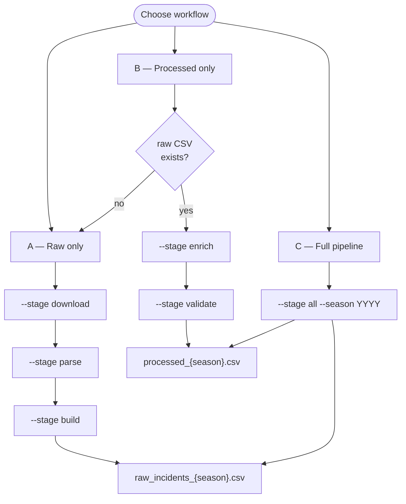
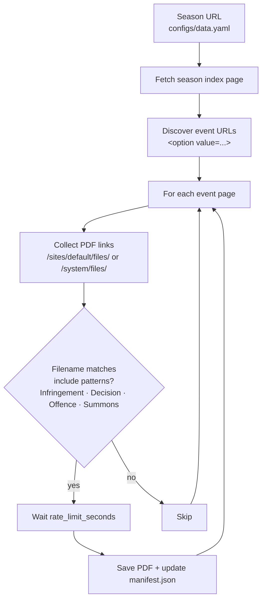
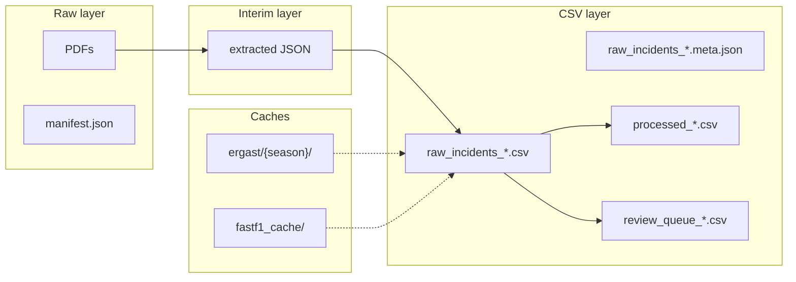

# FIA dataset generation (`fia_ml.data`)

Python package that turns FIA stewarding PDFs into season CSV datasets.

**Library code lives here** (`src/fia_ml/data/`). The **CLI entry point** is:

```text
dataset/scripts/run_pipeline.py
```

Run all commands below from the **project root** (`f1_penalty_predictor/`).

## Pipeline overview



---

## CLI entry and orchestration



---

## Quick start — 2020 season

From the project root, after `pip install -r requirements.txt`:

```bash
# Full pipeline (download → parse → build → enrich → validate)
python dataset/scripts/run_pipeline.py --stage all --season 2020
```

If FIA returns **403 Forbidden**, wait before retrying (rate limits after bulk downloads are common). Increase `scraper.rate_limit_seconds` in `configs/data.yaml` (e.g. `2.0` or `3.0`) and run **one season at a time**.

---

## Pipeline stages

| Stage | Flag | Module | Main output |
|-------|------|--------|-------------|
| 1 | `download` | `download.py` | `data/raw/fia/{season}/` + `manifest.json` |
| 2 | `parse` | `parsing.py` | `data/interim/extracted_documents/{season}/` |
| 3 | `build` | `incident_builder.py` | `dataset/csv/raw_incidents_{season}.csv` |
| 4 | `enrich` | `enrichment/` | Updates `raw_incidents_{season}.csv` in place |
| 5 | `validate` | `validation.py` | `processed_{season}.csv` + `review_queue_{season}.csv` |

`--stage all` runs stages 1–5 in order for the selected season(s).



---

## Three common workflows



### A. Raw CSV only (`raw_incidents_{season}.csv`)

PDF extraction and incident building — many columns intentionally empty until enrichment.

```bash
python dataset/scripts/run_pipeline.py --stage download --season 2020
python dataset/scripts/run_pipeline.py --stage parse   --season 2020
python dataset/scripts/run_pipeline.py --stage build   --season 2020
```

One-liner (PowerShell):

```powershell
python dataset/scripts/run_pipeline.py --stage download --season 2020; `
python dataset/scripts/run_pipeline.py --stage parse   --season 2020; `
python dataset/scripts/run_pipeline.py --stage build   --season 2020
```

**Output:** `dataset/csv/raw_incidents_2020.csv` and `raw_incidents_2020.meta.json`

Stages are **idempotent**: re-running `download` skips unchanged PDFs; `parse`/`build` can be re-run after code fixes.

---

### B. Processed CSV only (`processed_{season}.csv`)

Requires `raw_incidents_{season}.csv` to exist (from workflow A).

```bash
python dataset/scripts/run_pipeline.py --stage enrich    --season 2020
python dataset/scripts/run_pipeline.py --stage validate  --season 2020
```

One-liner:

```powershell
python dataset/scripts/run_pipeline.py --stage enrich --season 2020; `
python dataset/scripts/run_pipeline.py --stage validate --season 2020
```

**Outputs:**

- `dataset/csv/processed_2020.csv` — enriched, validated dataset
- `dataset/csv/review_queue_2020.csv` — rows flagged for manual review
- `reports/tables/data_quality_2020.json` — column fill rates

---

### C. Everything in one command

```bash
python dataset/scripts/run_pipeline.py --stage all --season 2020
```

Multiple seasons (run sequentially):

```bash
python dataset/scripts/run_pipeline.py --stage all --season 2020 --season 2021
```

All configured seasons (2019–2025 in `configs/data.yaml`):

```bash
python dataset/scripts/run_pipeline.py --stage all
```

---

## Download stage detail

How `download.py` discovers and filters PDFs for one season:



---

## Module reference

| File | Role |
|------|------|
| `config.py` | Loads `configs/data.yaml` into `PipelineConfig` |
| `schema.py` | Column list from `documentation/f1_dataset_example.csv` |
| `download.py` | FIA crawler: season → events → stewarding PDFs + manifest |
| `parsing.py` | PDF text extraction and FIA field parser |
| `incident_builder.py` | Parsed docs → incident rows, dedup, `incident_id` |
| `reference_data.py` | Read-only loaders for `data/reference/*.json` |
| `validation.py` | Schema checks, review queue, `processed_{season}.csv` export |
| `pipeline.py` | Stage orchestration (`run_pipeline`, `run_pipeline_for_seasons`) |
| `enrichment/` | Enrich stage — see [`enrichment/README.md`](enrichment/README.md) |

---

## Configuration

Primary config: [`configs/data.yaml`](../../../configs/data.yaml)

- `seasons` — FIA index URL per year
- `document_include_patterns` / `document_exclude_patterns` — which PDFs to download
- `paths` — raw PDFs, interim JSON, CSV output, caches
- `scraper.rate_limit_seconds` — delay between PDF downloads (raise if FIA blocks you)
- `enrichment` — Ergast/FastF1 URLs and fallback flags

Reference data (manually curated, read-only): `data/reference/` — see `data/reference/README.md`.

---

## Outputs layout

```text
data/raw/fia/2020/                     # PDFs + manifest.json
data/interim/extracted_documents/2020/ # Parsed JSON per document
dataset/csv/raw_incidents_2020.csv     # Raw incident table
dataset/csv/raw_incidents_2020.meta.json
dataset/csv/processed_2020.csv         # After enrich + validate
dataset/csv/review_queue_2020.csv      # Regenerated on validate (optional to keep)
reports/tables/data_quality_2020.json
data/raw/race_data/ergast/2020/        # Ergast API cache
data/raw/race_data/fastf1_cache/       # FastF1 session cache
```



---

## Related docs

- [`dataset/README.md`](../../../dataset/README.md) — CLI folder overview
- [`documentation/dataset_generation_runbook.md`](../../../documentation/dataset_generation_runbook.md) — operator runbook
- [`DATASET_GENERATION_PLAN.md`](../../../DATASET_GENERATION_PLAN.md) — full implementation plan
