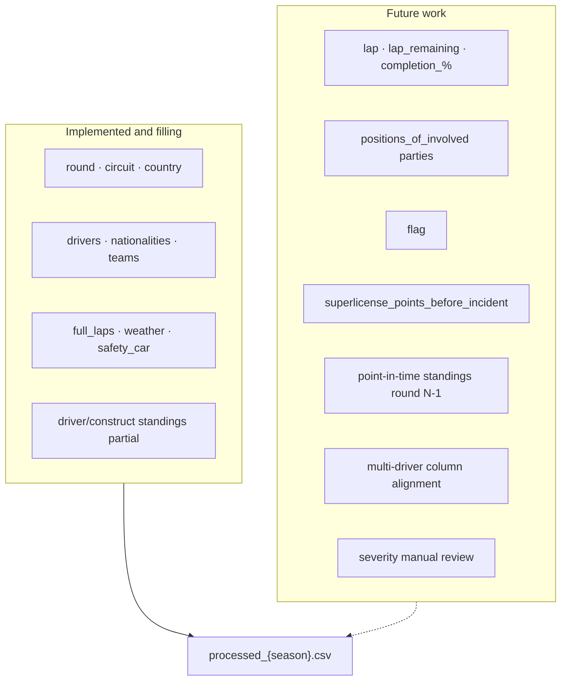
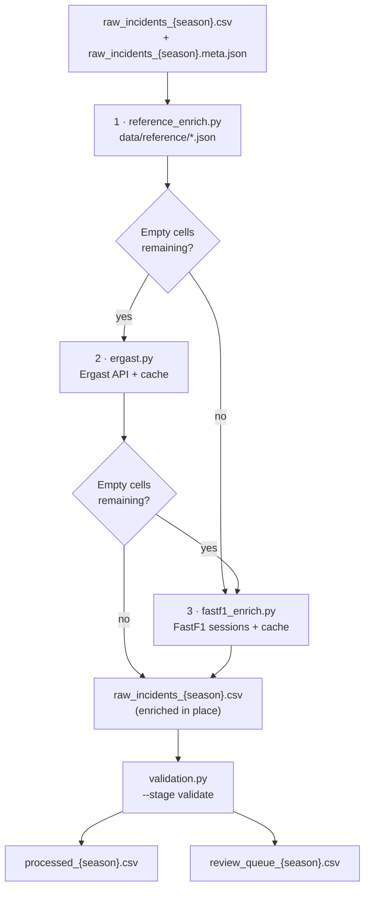
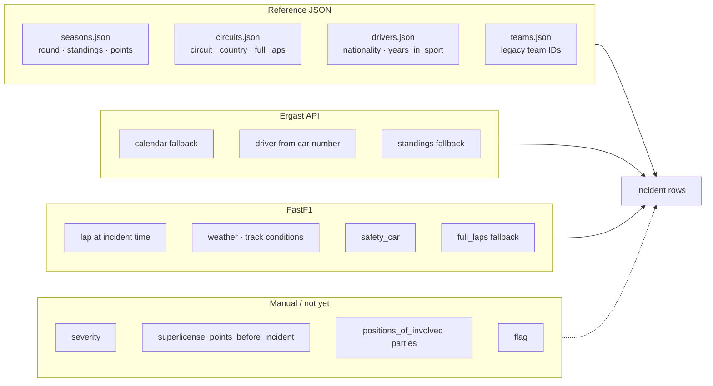
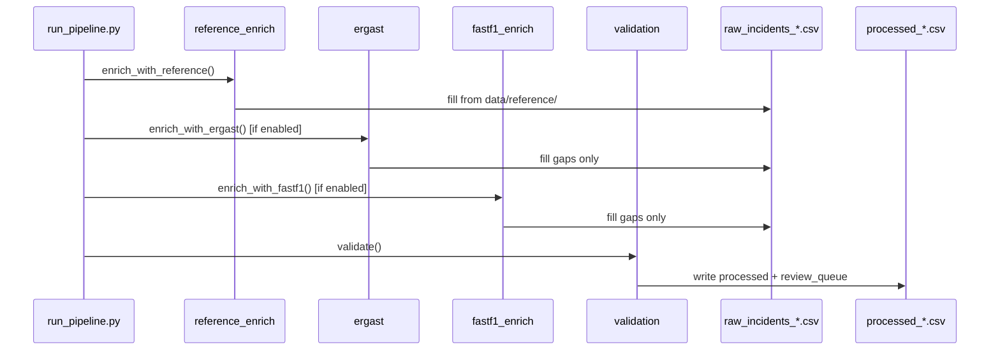
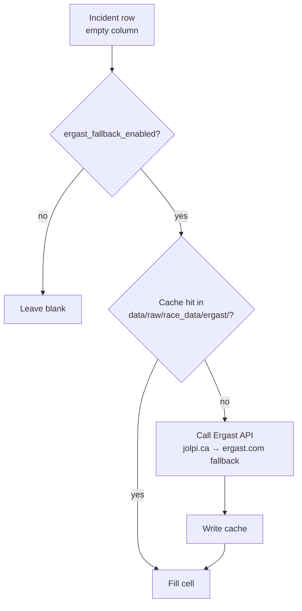
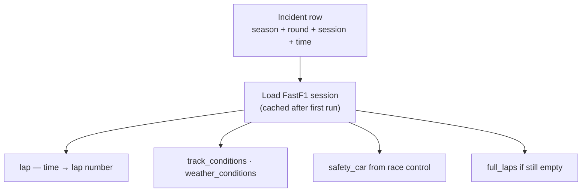
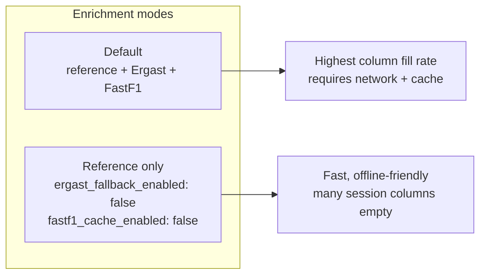

# Dataset enrichment (`fia_ml.data.enrichment`)

Fills empty columns in `raw_incidents_{season}.csv` after the **build** stage. Invoked by `--stage enrich` in the CLI (or as part of `--stage all`).

**Seasons with enriched output today:** 2019, 2025. Seasons **2020–2024** have no processed data yet (download blocked) — enrichment will run automatically once those seasons are built.

---

## Future improvements

Tracked gaps between the target schema ([`documentation/f1_dataset_example.csv`](../../../documentation/f1_dataset_example.csv)) and what the enrichers fill today. Observed fill rates are from `reports/tables/data_quality_{season}.json` on the 2019 and 2025 runs.

### Missing seasons

| Season | Enrichment status | Blocker |
|--------|-------------------|---------|
| 2019 | Enriched + validated | — |
| 2020–2024 | **No data** | FIA PDF download blocked (403/WAF) at `download` stage |
| 2025 | Enriched + validated | — |

No enrichment code changes are needed for missing seasons — run the pipeline once PDFs exist:

```bash
python dataset/scripts/run_pipeline.py --stage enrich --season 2020
python dataset/scripts/run_pipeline.py --stage validate --season 2020
```

### Columns not yet enriched (or only partially)



| Column | Status | 2019 fill | 2025 fill | Planned fix |
|--------|--------|-----------|-----------|-------------|
| `lap` | Broken / not aligning | 0% | 0% | Parse PDF `time` reliably; map to FastF1 session timeline |
| `lap_remaining` | Derived from `lap` | 0% | 0% | Auto-computed in `validation.py` once `lap` works |
| `completion_percentage` | Derived from `lap` | 0% | 0% | Auto-computed in `validation.py` once `lap` works |
| `positions_of_involved parties` | **Not implemented** | 0% | 0% | FastF1 running positions at incident lap/time |
| `flag` | **Not implemented** | 0% | 0% | FastF1 race control messages (yellow/red/etc.) |
| `superlicense_points_before_incident` | **Not implemented** | 0% | 0% | Rolling sum of `superlicense_points_added` from prior incidents per driver |
| `severity` | **Manual only** | 0% | 0% | Human labels via `review_queue_{season}.csv` |
| `driver_standings`, `driver_points`, `nationalities`, `years_in_sport` | Partial on **multi-driver** rows | 99%* | 75%* | Per-driver Ergast/reference lookup when `num_drivers > 1` |
| `construct_standings`, `construct_points` | Partial | 55% | 68% | Ergast constructor standings per round |
| `driver_standings`, `driver_points` (timing) | Approximate | 99% | 75% | Replace season totals with **round N−1** point-in-time standings |
| `driver_at_fault` | Weak heuristics | 5% | 4% | Improve PDF Reason/Fact parsing |
| `sector` | Partial (turn→sector map) | 48% | 3% | Expand `circuits.json` corner/sector maps |

\*Overall fill rate is high, but validation reports **misaligned multi-value lengths** on two-driver incidents (~19 rows in 2019, ~21 in 2025).

### Suggested implementation order

1. **Multi-driver column alignment** — fix validation errors on two-car incidents
2. **`lap` / time alignment** — unlocks `lap_remaining` and `completion_percentage`
3. **Point-in-time standings** — Ergast round N−1 instead of season totals from `seasons.json`
4. **`positions_of_involved parties` + `flag`** — additional FastF1 session features
5. **`superlicense_points_before_incident`** — dataset-internal rolling feature
6. **`severity`** — manual review workflow (ongoing)

---

## Enrichment flow

Enrichment runs in a **fixed order**. Reference data is applied first; Ergast and FastF1 only fill cells that are still empty (`fill_gaps_only=True`).



---

## Where each column comes from



---

## Event → round mapping

Reference enrichment maps FIA event titles to calendar rounds:


---

## How to run

From the project root, with `raw_incidents_{season}.csv` already built:

```bash
python dataset/scripts/run_pipeline.py --stage enrich --season 2020
```

Then export the processed dataset:

```bash
python dataset/scripts/run_pipeline.py --stage validate --season 2020
```

Or combine with the full pipeline:

```bash
python dataset/scripts/run_pipeline.py --stage all --season 2020
```

**Note:** `--stage enrich` writes back to `dataset/csv/raw_incidents_{season}.csv` (enriched in place). `--stage validate` reads that file and writes `processed_{season}.csv`.



---

## Modules

### `reference_enrich.py` — primary source

Loads verified local files from `data/reference/`:

| File | Columns filled |
|------|----------------|
| `seasons.json` | `round`, `rounds`, `num_teams`, `current_top_4_drivers`, driver/constructor standings & points |
| `circuits.json` | `circuit`, `country`, `first_season`, `full_laps` (race sessions via `total_laps`) |
| `drivers.json` | `nationalities`, `years_in_sport` (from `debut`) |
| `teams.json` | Resolves `legacy_ids` when matching constructor slugs |

Uses `event_name` on each circuit to map FIA event titles (e.g. `"Abu Dhabi Grand Prix"`) to calendar rounds in `seasons.json`.

**Limitation:** standings in `seasons.json` are **season totals**, not point-in-time per round.

---

### `ergast.py` — API fallback

Runs only when `enrichment.ergast_fallback_enabled: true` in `configs/data.yaml` (default).



Fills **gaps** left by reference enrichment:

- `round`, `circuit`, `country` from Ergast calendar
- Car number → driver slug via race results
- Standings, nationalities, points when reference data is missing

---

### `fastf1_enrich.py` — session context

Uses [FastF1](https://github.com/theOehrly/FastF1) with cache at `data/raw/race_data/fastf1_cache/`.



Fills (gap-only unless reference did not set the field):

| Column | Source |
|--------|--------|
| `full_laps` | Session lap count (if not set from `circuits.json`) |
| `lap` | Incident time → lap number (race sessions only) |
| `track_conditions`, `weather_conditions` | Session weather |
| `safety_car` | Race control messages (SC / VSC / none) |

**Not implemented yet:** `positions_of_involved parties`, `flag`.

First run per season is **slow** (downloads session data per round). Later runs use the cache.

`lap` often stays empty when PDF `time` fields are malformed — those rows appear in `review_queue_{season}.csv`.

---

### `common.py` — shared helpers

- `load_meta()` — reads `raw_incidents_{season}.meta.json` (event, car number, parse confidence)
- `map_event_to_round()` — event title → round via reference calendar
- `is_blank()` — gap detection for fallback enrichers
- `resolve_team_id()` — legacy team id → canonical slug

---

## Columns still manual / unimplemented

See [Future improvements](#future-improvements) for the full table with fill rates and planned fixes. Summary:

| Column | Why empty today |
|--------|-----------------|
| `severity` | Subjective — fill via review queue |
| `superlicense_points_before_incident` | Rolling penalty history not built |
| `positions_of_involved parties` | Planned FastF1 feature |
| `flag` | Not implemented |
| `lap`, `lap_remaining`, `completion_percentage` | PDF time → FastF1 lap alignment failing |

---

## Config flags (`configs/data.yaml`)

```yaml
enrichment:
  ergast_base_url: "https://api.jolpi.ca/ergast/f1"
  ergast_fallback_url: "https://ergast.com/api/f1"
  ergast_fallback_enabled: true   # set false to use reference JSON only
  fastf1_cache_enabled: true
```

To skip external APIs entirely (reference JSON only):

```yaml
enrichment:
  ergast_fallback_enabled: false
  fastf1_cache_enabled: false
```

You will lose lap-at-incident-time, weather, and safety-car fields unless added elsewhere.



---

## Public API

```python
from fia_ml.data.enrichment import (
    enrich_with_reference,
    enrich_with_ergast,
    enrich_with_fastf1,
)
```

Normally you do not call these directly; use `dataset/scripts/run_pipeline.py --stage enrich`.

- Parent pipeline docs: [`../README.md`](../README.md)
- CLI and dataset coverage: [`../../../dataset/scripts/README.md`](../../../dataset/scripts/README.md)
