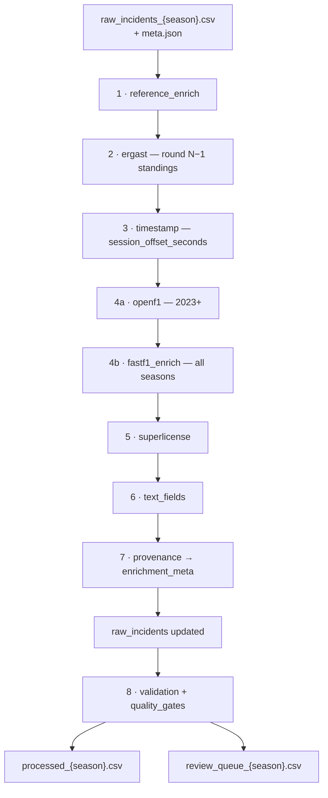
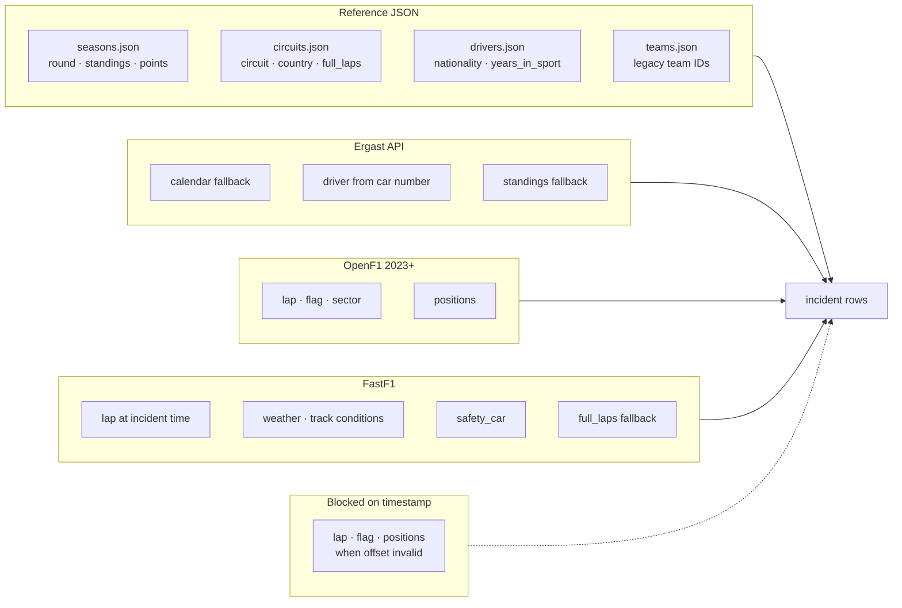
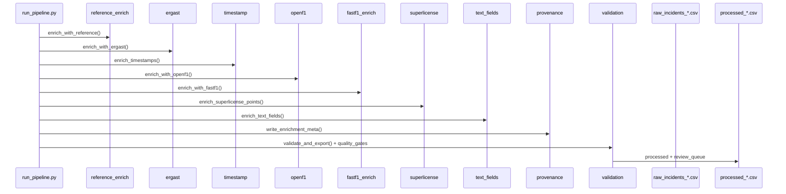
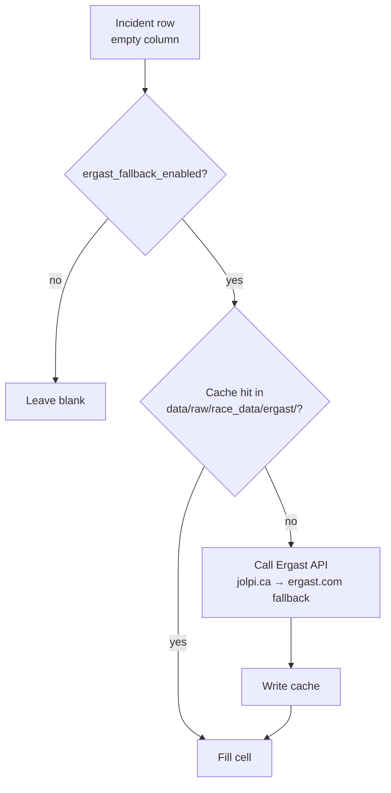
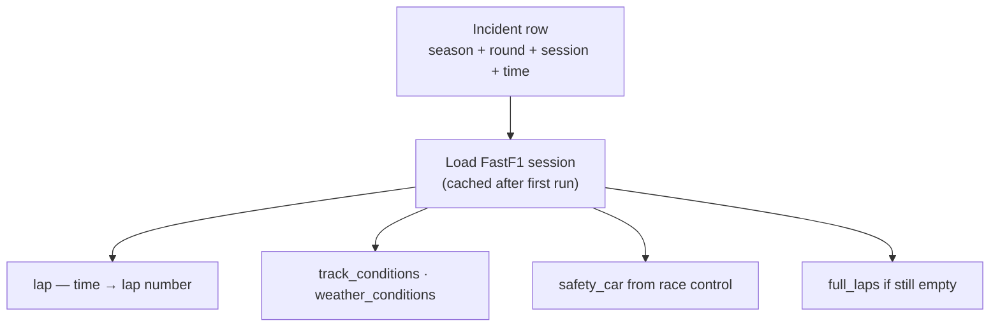

# Dataset enrichment (`fia_ml.data.enrichment`)

Fills empty columns in `raw_incidents_{season}.csv` after the **build** stage. Invoked by `--stage enrich` in the CLI (or as part of `--stage all`).

**Seasons with enriched output today:** 2019, 2025. Seasons **2020–2024** have no processed data yet (download blocked) — enrichment will run automatically once those seasons are built.

---

## Open gaps

Measured on 2019 + 2025 after full enrichment run (2026-09-09). Registry: [`current_gaps.md`](../../../current_gaps.md).

### Missing seasons

| Season | Status |
|--------|--------|
| 2019, 2025 | Enriched + validated |
| 2020–2024 | No CSVs — FIA WAF blocks download; modules run once PDFs exist |

### Fill rates vs targets

| Column | 2019 | 2025 | Status |
|--------|------|------|--------|
| `driver_standings` / points (round N−1) | 96% | 78% | **Built** — 2019 passes 90% gate; 2025 below target |
| `superlicense_points_before_incident` | 99% | 81% | **Built** |
| `full_laps`, weather, `safety_car` | 90% | 89% | **Built** |
| `driver_at_fault` | 25% | 25% | **Built** (rule assist + review queue) |
| `lap`, `flag`, `positions_of_involved parties` | 0–2% | 0% | **Blocked** — PDF `time` is document clock, not session time |
| `sector` | 48% | 3% | Below gate (70% / 50%) |
| `severity` | 0% | 0% | Suggestions in review queue only |
| Multi-driver `**` columns | — | — | ~20 misaligned rows/season (`car_*` placeholders) |

Quality gates: `reports/tables/enrichment_report_{season}.json` · provenance: `data/interim/enrichment_meta/{season}.json`.

---

## Enrichment flow

Fixed order in `pipeline.py`. Config: `configs/enrichment.yaml` (loaded via `--enrichment-config`).



---

## Where each column comes from



---

## Event → round mapping

Reference enrichment maps FIA event titles to calendar rounds:


---

## How to run

From the project root, with `raw_incidents_{season}.csv` already built:

```bash
python dataset/scripts/run_pipeline.py --stage enrich --season 2020
```

Then export the processed dataset:

```bash
python dataset/scripts/run_pipeline.py --stage validate --season 2020
```

Or combine with the full pipeline:

```bash
python dataset/scripts/run_pipeline.py --stage all --season 2020
```

**Note:** `--stage enrich` writes back to `dataset/csv/raw_incidents_{season}.csv` (enriched in place). `--stage validate` reads that file and writes `processed_{season}.csv`.



---

## Modules

### `reference_enrich.py` — primary source

Loads verified local files from `data/reference/`:

| File | Columns filled |
|------|----------------|
| `seasons.json` | `round`, `rounds`, `num_teams` (standings deferred to Ergast when `overwrite_reference_standings: true`) |
| `circuits.json` | `circuit`, `country`, `first_season`, `full_laps` (race sessions via `total_laps`) |
| `drivers.json` | `nationalities`, `years_in_sport` (from `debut`) |
| `teams.json` | Resolves `legacy_ids` when matching constructor slugs |

Uses `event_name` on each circuit to map FIA event titles (e.g. `"Abu Dhabi Grand Prix"`) to calendar rounds in `seasons.json`.

Standings in `seasons.json` are season totals; Ergast round N−1 overwrites them when configured in `configs/enrichment.yaml`.

---

### `ergast.py` — calendar + round N−1 standings

Runs when `enrichment.ergast_fallback_enabled: true` in `configs/data.yaml` (default).



- `round`, `circuit`, `country` from Ergast calendar
- Car number → driver slug via race results
- **Round N−1** driver/constructor standings, nationalities, teams (overwrites reference when configured)
- Per-driver alignment for multi-value `**` columns

---

### `timestamp.py` — incident time

Parses PDF `time` into `session_offset_seconds` (written to interim meta). **Current blocker:** most PDFs yield document-header clock, not on-track session time (~1.5% valid offsets).

---

### `openf1.py` — 2023+ race state

OpenF1 API with cache at `data/raw/race_data/openf1_cache/`. Session index: `openf1_sessions_{season}.json` in cache dir. Fills `lap`, `flag`, `sector`, `positions_of_involved parties`, `full_laps` when timestamp + session keys resolve.

---

### `fastf1_enrich.py` — session context (all seasons)

Uses [FastF1](https://github.com/theOehrly/FastF1) with cache at `data/raw/race_data/fastf1_cache/`.



| Column | Source |
|--------|--------|
| `full_laps` | Session lap count |
| `lap` | `session_offset_seconds` → lap number |
| `flag`, `positions_of_involved parties`, `sector` | Race control + timing at offset (gap-fill; won't overwrite OpenF1 on 2023+) |
| `track_conditions`, `weather_conditions` | Session weather |
| `safety_car` | Race control messages (SC / VSC / none) |

First run per season is **slow**; cache at `data/raw/race_data/fastf1_cache/`.

---

### `superlicense.py` — rolling penalty points

`superlicense_points_before_incident` = sum of prior `superlicense_points_added` per driver in season (temporal order by round → date → incident_id).

---

### `text_fields.py` — fault + severity assist

Rule-based `driver_at_fault` (CSV write if confidence ≥ 0.7) and `severity` suggestions (review queue + meta only).

---

### `provenance.py` — field-level metadata

Writes `data/interim/enrichment_meta/{season}.json` with source, round used, match error per enriched field.

---

### `quality_gates.py` — fill-rate targets

Evaluated during `--stage validate`. Merges into `reports/tables/data_quality_{season}.json` and writes `reports/tables/enrichment_report_{season}.json`.

---

### `common.py` — shared helpers

- `load_meta()` — reads `raw_incidents_{season}.meta.json` (event, car number, parse confidence)
- `map_event_to_round()` — event title → round via reference calendar
- `is_blank()` — gap detection for fallback enrichers
- `resolve_team_id()` — legacy team id → canonical slug

---

## Config

**`configs/enrichment.yaml`** — standings overwrite, timestamp tolerance, OpenF1/FastF1 toggles, text-field confidence, quality-gate targets.

**`configs/data.yaml`** — API cache paths, `ergast_fallback_enabled`, `fastf1_cache_enabled`.

```bash
python dataset/scripts/run_pipeline.py --enrichment-config configs/enrichment.yaml --stage enrich --season 2025
```

---

## Public API

```python
from fia_ml.data.enrichment import (
    enrich_with_reference,
    enrich_with_ergast,
    enrich_timestamps,
    enrich_with_openf1,
    enrich_with_fastf1,
    enrich_superlicense_points,
    enrich_text_fields,
    write_enrichment_meta,
)
```

Normally you do not call these directly; use `dataset/scripts/run_pipeline.py --stage enrich`.

- Parent pipeline docs: [`../README.md`](../README.md)
- CLI and dataset coverage: [`../../../dataset/scripts/README.md`](../../../dataset/scripts/README.md)
